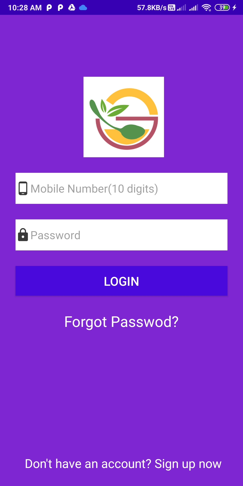
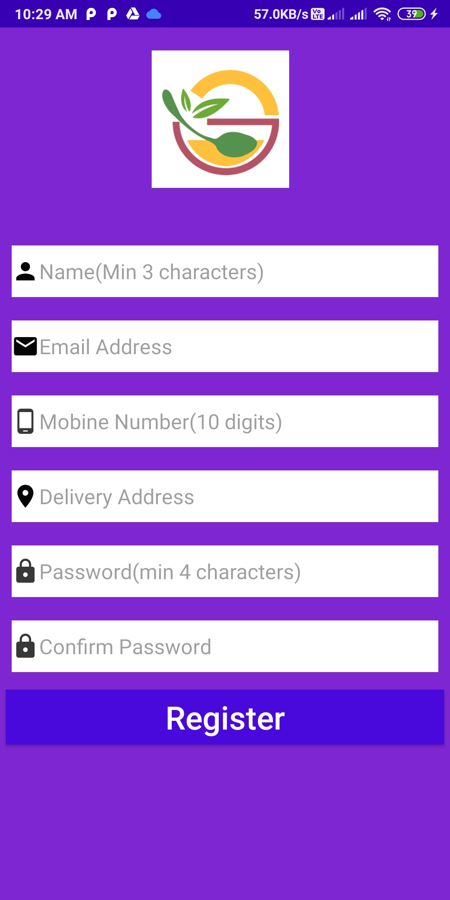
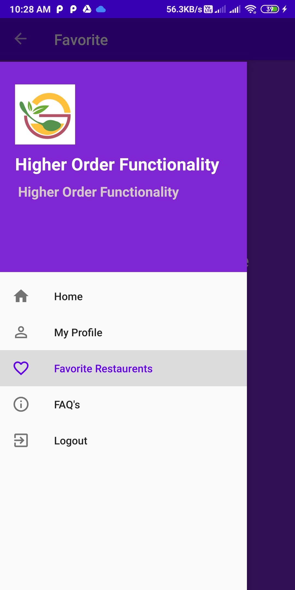
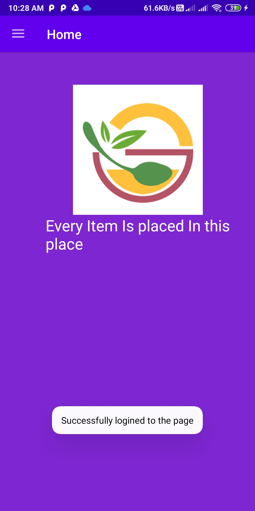
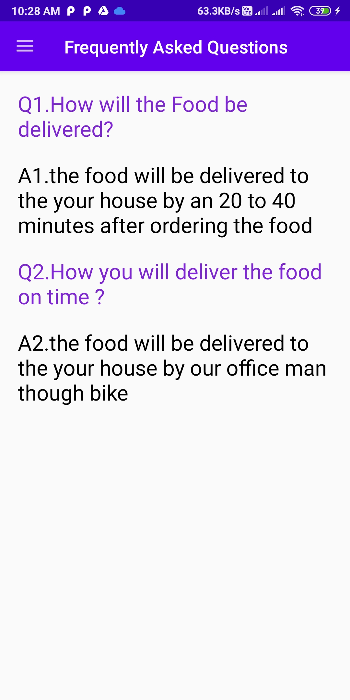
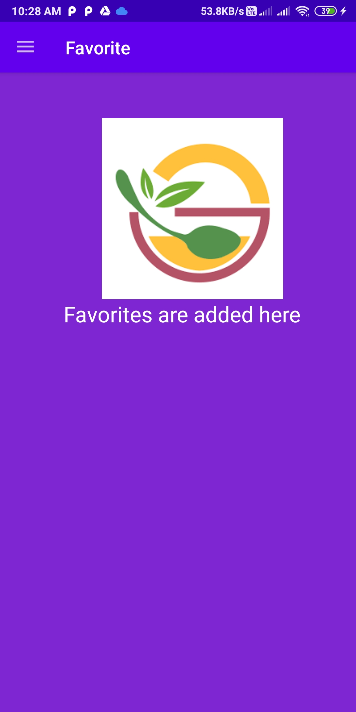
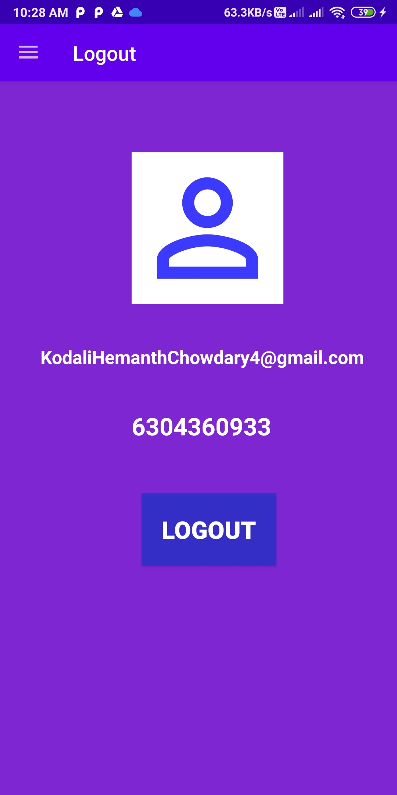

# FoodRunner
Delivering The Food Easily Through Online
# How to see the project
Download the ".ZIP" file and extract the files
because the files are large to keep and may be files will corrupt.
# Overview About FoodRunner App
App id developed in Android Studio by Using the Kotlin Language
In the App we are going with Login page and checking the items to order and adding Favorite items finnaly can view our profile and then logout
# SCREEN SHOTS
The all Pages available in the app are shown below 
WelcomePage
Login
Register
Forgot password
DashBoard
Home Page
My Profile Page
Freaquently Asked Questions
Favorites
Logout
# Welcome Page

# Login

# Register Page

# Forgot Password Page

# DashBoard Page

# Home Page

# MyProfile Page

# FAQ Page

# Favorites Page

# Logout Page

